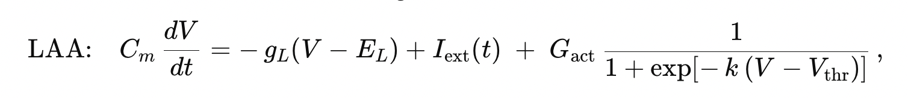
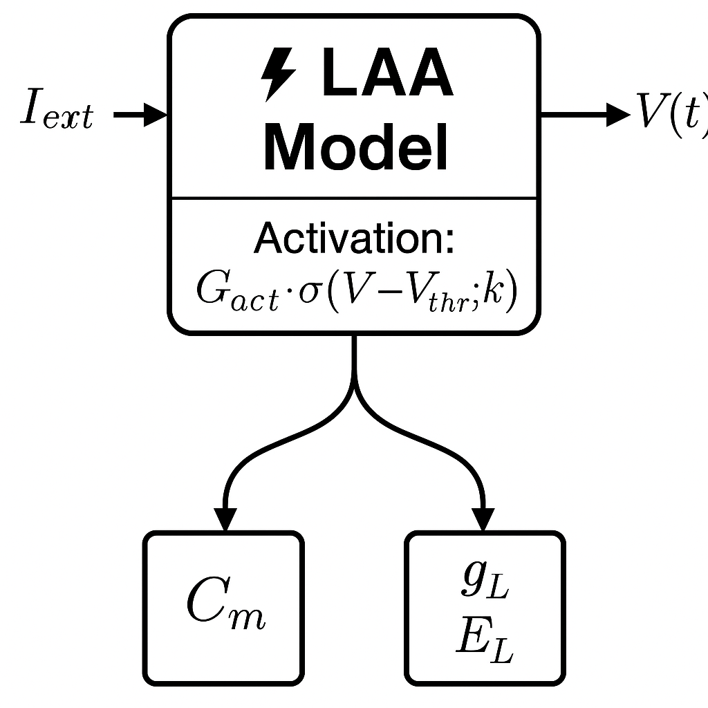
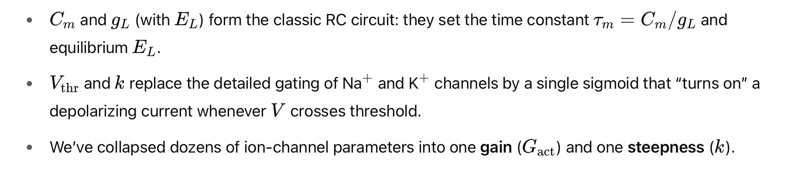

[](https://opensource.org/licenses/MIT)

# Bayesian Inference of Neuron Activation Parameters via Leaky Adaptive Activation (LAA) model usig BayesFlow

## Overview

This project aims to simplify the complex and extensive Hodgkin–Huxley model to using four parameters and still captures passive integration,leak, and a sharp, threshold-like “activation” event. We name this simplified version as the Leaky Adaptive Activation. 

---

## Model definition

- We define four parameters:
This section describes the biophysical parameters used in the membrane potential model.

| Parameter               | Symbol        | Description                                                         |
|-------------------------|---------------|---------------------------------------------------------------------|
| Membrane capacitance    | `C_m`         | How much charge is required to change the membrane voltage (acts like integration “inertia”). |
| Leak conductance        | `g_L`         | Passive leak current that pulls the membrane voltage back toward the resting potential.   |
| Resting potential       | `E_L`         | Baseline membrane voltage in the absence of external inputs.        |
| Activation slope        | `k`           | Sharpness of the nonlinearity once the membrane voltage crosses threshold. |
| Activation threshold    | `V_thr`       | Voltage level around which the nonlinear activation term rapidly increases. |

---

### Usage

We adjust the following parameters in our model configuration to explore how each one influences the neuron's voltage dynamics:

```python
params = {
    "C_m": 1.0,      # µF/cm²
    "g_L": 0.1,      # mS/cm²
    "E_L": -65.0,    # mV
    "k": 10.0,       # mV
    "V_thr": -50.0   # mV
}

## Parameter Tuning 

- **Increase `C_m`** → Slower voltage changes (more inertia)
- **Increase `g_L`** → Stronger leak, more resistance to depolarization
- **Adjust `E_L`** → Changes the baseline/resting voltage
- **Decrease `k`** → Sharper, more switch-like activation
- **Increase `V_thr`** → Requires stronger input to activate the nonlinearity

---

## Governing ODE to simulate train data

The  is used to simulate our training data. 

Where:

- \( C_m \) is the membrane capacitance
- \( g_L \) is the leak conductance
- \( E_L \) is the resting potential
- \( I_{\text{ext}}(t) \) is the external input current
- \( G_{\text{act}} \) is a scaling factor for the nonlinear term
- \( \sigma(x; k) \) is the sigmoid activation function:

\[
\sigma(x; k) = \frac{1}{1 + \exp(-k x)}
\]

---

## Statistical Model

LAA model reduces to only one resistor, one capacitor, plus a single nonlinear “activation block.”



This diagram illustrates the structure of the LAA model.



### Priors

## Simulator

---

## BayesFlow Setup

### Approximator

- **SummaryNet**:  
  - LSTM (for raw voltage trace input)  
  - MLP (for summary statistics like ISI, spike counts)
- **InferenceNet**:  
  - Normalizing flow-based posterior estimator using Coupling Flows

### Architecture

- **SummaryNet**:  
  - 2-layer LSTM or MLP  
  - 64–128 hidden units  
  - ReLU activation
- **InferenceNet**:  
  - 4–6 affine coupling layers  
  - Batch normalization between layers

---

## Training

- **Samples**: 100,000 simulated parameter-trajectory pairs (offline generation)
- **Epochs**: 300
- **Batch Size**: 256
- **Optimizer**: Adam  
  - Learning Rate: \( 1 \times 10^{-4} \)  
  - Optional: cosine annealing or exponential decay schedule

---

## Diagnostics

- **Convergence**:  
  - Monitor training and validation loss curves

- **Simulation-Based Calibration (SBC)**:  
  - Rank histograms comparing true vs. inferred parameters

- **Posterior Predictive Checks (PPC)**:  
  - Sample parameters from posterior \( q_\phi(\theta \mid y_{\text{obs}}) \)  
  - Simulate voltage traces and compare with observed ones

- **Typicality Checks**:  
  - Project test data to summary space  
  - Assess alignment with training data distribution

---

## Inference & Validation

- Evaluate performance on held-out synthetic trajectories
- Analyze posterior \( q_\phi(\theta \mid y_{\text{test}}) \) for:
  - **Bias** in parameter estimates
  - **Coverage** of credible intervals
  - **Posterior contraction** (narrowing with more data)
- Optionally apply the model to real-world or biologically plausible traces

---

## Limitations

- The Leaky Adaptive Activation model


---

## Installation & Backend
'''
pip install 
'''
- The backend used for Keras3 is JAX:
'''
os.environ["KERAS_BACKEND"] = "jax"
'''

---

## Documentation

For more details, check out the [BayesFlow Docs](https://bayesflow.org/main/index.html).
